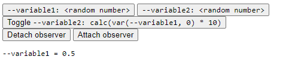

# `@bramus/style-observer` – MutationObserver for CSS

[](https://brm.us/style-observer)

[](https://www.npmjs.com/package/@bramus/style-observer)
[](https://bundlejs.com/?q=%40bramus%2Fstyle-observer)
[](./LICENSE)
[](https://codepen.io/bramus/pen/WNqKqxj?editors=1111)

## CSS Style Observer?

While [`MutationObserver`](https://developer.mozilla.org/en-US/docs/Web/API/MutationObserver) can track DOM changes, it cannot be used to track style changes. This library plugs that gap and allows you to set up an observer that notifies you when the computed value of a tracked CSS property has changed.

The main use case for this library is to track changes to [CSS Custom Properties](https://developer.mozilla.org/en-US/docs/Web/CSS/Using_CSS_custom_properties) _(aka CSS Variables)_ but it can be used for other properties as well.



## Installation

```
npm install @bramus/style-observer
```

## Usage

```js
// Vanilla JS (CommonJS)
const CSSStyleObserver = require('@bramus/style-observer');

// Vanilla JS (ES6)
import CSSStyleObserver, { NotificationMode, ReturnFormat } from '@bramus/style-observer';

// TypeScript
import CSSStyleObserver, { NotificationMode, ReturnFormat } from '@bramus/style-observer/src/index.ts'

const cssStyleObserver = new CSSStyleObserver(
    /* CSS Properties to observe */
    ['--variable1', '--variable2', 'display', 'border-width'],

    /* This is called whenever there are changes */
    (values) => {
        console.log(values['--variable1'], values['--variable2'], values['display']);
    },                                                 
    /* Configuration options */
    {
      notificationMode?: NotificationMode.CHANGED_ONLY,
      returnFormat?: ReturnFormat.VALUE_ONLY,
    }
);

cssStyleObserver.attach(document.body);  /* Attach observer to `document.body` */

//...

cssStyleObserver.detach();               /* Detach observer */
```

### Configuration options

* `notificationMode` (`NotificationMode`, default: `CHANGED_ONLY`): Determines whether to pass all properties (`ALL`) or only the changed ones (`CHANGED_ONLY`) into the callback
* `ReturnFormat` (`ReturnFormat`, default: `VALUE_ONLY`): Determines the format of the data passed to the callback. Below are the options:
  * `VALUE_ONLY`: The callback receives an object with property names as keys and their current values:
    ```js
    {
        "--my-variable": "1.0",
        "display": "block"
    }
    ```
  * `OBJECT`: The callback receives an object with property names as keys and detailed information as values:
    ```js
    {
        "--my-variable":{
            "value": "1.0",
            "previousValue": "0.0",
            "changed": true
        }
    }
    ```

Try out a demo on CodePen: [https://codepen.io/bramus/pen/WNqKqxj](https://codepen.io/bramus/pen/WNqKqxj?editors=1111)

### Observing multiple elements

One single `CSSStyleObserver` instance can be used to observer mutliple elements.

```js
const observer = new CSSStyleObserver(…);

observer.attach(document.getElementById('mainbutton'));
observer.attach(document.getElementById('otherbutton'));
```

To unobserve a single element, pass a reference to it in `CSSStyleObserver`’s `detach()`.

```js
observer.detach(document.getElementById('mainbutton'));
```

When passing no argument in `detach()`, the observer will unobserve _all_ observed elements.

## Local Development

Below is a list of commands you will probably find useful.

### `npm run demo`

Runs the project in development/watch mode, starts HTTP server and navigates to `http://localhost:8080/demo` 

### `npm start`

Runs the project in development/watch mode. Your project will be rebuilt upon changes. 

### `npm run build`

Bundles the package to the `dist` folder.
The package is optimized and bundled with Rollup into multiple formats (CommonJS, UMD, and ES Module).

## FAQ

### Browser support?

The requirement for this library to work is support for CSS Transitions.

However, to also support properties that animate discretely – such as Custom Properties but also properties like `display` – the browser **must** support `transition-behavior: allow-discrete`.

In practice, this translates to the following list of browsers:

- Safari 18
- Firefox 129
- Google Chrome 117

Note: All browser versions listed above have bugs when transitioning Custom Properties. As it stands right now, the only cross-browser way to observe Custom Properties with `@bramus/style-observer` is to register the property with a syntax of `"<custom-ident>"`, which might not be a good fit for your use-case. See [https://brm.us/style-observer#custom-props](https://brm.us/style-observer#custom-props) for a detailed write-up.

### How is this library better when compared to other libraries?

This library doesn’t use `requestAnimationFrame` but responds to transition events. Therefore it doesn’t put a recurring and constant strain on the main thread.

The original [`css-variable-observer` library](https://github.com/fluorumlabs/css-variable-observer) that coined this approach only works with custom properties and numeric values. This library can work with any property having any value.

### How is this library worse when compared to other libraries?

The properties that are being tracked are set to a very short transition time. If you relied on transitions for those properties, that is now no longer possible.

You can work around this by putting a value into a custom property that you track and then use that custom property in a regular property. The regular property can have any transition you want.

Also note that changing the value `transition` property yourself will make this library no longer work.

## Acknowledgements

This library builds upon [the `css-variable-observer` project by Artem Godin](https://github.com/fluorumlabs/css-variable-observer). The suggestion to leverage `transition-behavior: allow-discrete` was done by [Jake Archibald](https://jakearchibald.com/) in [w3c/csswg-drafts#8982](https://github.com/w3c/csswg-drafts/issues/8982#issuecomment-2317164825).
